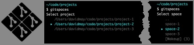

# gitspaces - A git development workspace manager


# 

> Coming in Spring 2024

## What is GitSpaces

GitSpaces is a structured folder/directory system for working concurrently on independent parallel development tasks within and across multiple proects.

For those of you with experience using, ahem, the ClearCase vcs, you're familiar with the concept of ClearCase Views. GitSpaces is clearcase view for git projects.

A GitSpace is an isolated workspace that has all of your project code where you can work on ONE THING. A GitSpace project is a collection of spaces (think independent clones) for the project. If you are asked to fix a bug or something else in parallel, you just open a new space and work there.

## Project Roadmap

See [GitSpaces v2 Roadmap](https://github.com/users/davfive/projects/5/views/2)

## Getting Started

gitspaces is implemented in Go, so

1. [Install Go](https://go.dev/doc/install)
   
2. Install GitSpaces  
   ```
   $ go install github.com/davfive/gitspaces/v2@latest
     -> installs to ~/go/bin/gitspaces
   ```
3. Run GitSpaces setup
   ```
   $ gitspaces setup
     -> creates ~/.gitspaces/...
   $ vim ~/.gitspaces/config.yaml
     -> update ProjectPaths list
   $ vim ~/.bashrc (or ~/.zshrc)
     -> add '. ~/.gitspaces/shellfunction.sh'
     -> add 'alias gs=gitspaces' (optional)
   $ . ~/.bashrc (or ~/.zshrc)
   ```

4. Create a GitSpace project
   ```
   $ cd /path/to/one/of/ProjectPaths
   $ gitspaces create REPO_URL
     -> creates project and cd's into space
   ```

5. Start using GitSpaces

## Documentation

### The `gitspaces` command 
#### USAGE
`gitspaces COMMAND`Simplify your life with `alias gs=gitspaces`.

#### WHERE
COMMAND  | Description
---------|------------------------
`create` | Creates a new GitSpace project from a git repo url
`switch` | Switch spaces. Default, same as `gitspaces` w/o a command.
`rename` | Rename a current gitspace
`sleep`  | Archive a gitspace and wakes up another one
`code`   | Launches Visual Studio Code Workspace for the space

### Examples


## GitSpace Structure

### GitSpace Project Layout
```
~/.../projects
 └── project-a
     ├── __GITSPACES_PROJECT__              
     ├── .code-workspace
     │   └── project-a~active-1.code-workspace
     ├── .zzz
     │   ├── zzz-0/
     │   │   └──  ... repo cloned here
     │   ├── zzz-1/
     │   │   └── ... zzz-0 copied here
     │   ├── zzz-...
     │   └── zzz-N/
     ├── active-1/
     │   └── ... active repo/space
     ├── active-...
     └── active-N/
```

### GitSpace User Config
```
# Created first time gitspaces is run
~/.gitspaces/
 ├── config.yaml (must be filled in before use)
 └── shells
     ├──  bashrc (bash wrapper function)
     └──  zshrc  (zsh wra...)
```

#### config.yaml

```yaml
~/.gitspaces/config.yaml

ProjectPaths:
    - /path/to/a/projects/directory
    - /path/to/another/directory
    - ...
```
